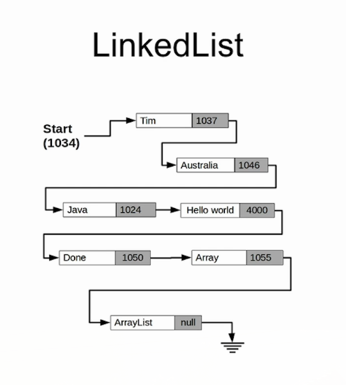

# List Types

List is a `java` interface that is implemented by many casses.

### Array
Arrays inherit from the `List` object. Plain arrays **can only store primitive types**.

#### Syntax:
```java
int[] numbers = new int[10]; // Creates an array with 10 uninitialized positions
numbers[5] = 55;
// or
int[] otherNumbers = { 1, 2, 3, 4, 5, 6, 7, 8, 9 };
// or reassigning (de-referencing)
initializedArray = new int[] { 1, 2, 3, 4, 5, 6, 7, 8, 9 };
```

#### Simple iteratation
```java
public static void printArray(int[] array) {
	for (int i=0; i<array.length; i++) {
		System.out.println("Element " + i + " value is " + array[i]);
	}
}
```

### Sort an Array
This mutates the original array:
```java
Arrays.sort(copyintegers);
```

### Resizing an Array
#### The Manual way
You should copy the old array in a new one and then reassign the new size to the array and loop through the original one to fill up the newly assigned array.

### Output an Array
```java
System.out.println(Arrays.toString(arrayName));
```

### Lists
An **Interface** that represents the structure for an **ordered collection or sequence** of elements.

#### ArrayLists
Extends from `AbstractList` which implements the `List` interface. The interesting feature of `ArrayLists` is that they assign new memory space dynamically when they are resized. `ArrayList` are defined with a **generic type** which informs the compiler on what kind of data they are holding:
```java
private ArrayList<String> myArrayList = new ArrayList<String>();

private void addElementToArrayList(String el) {
	// the logic for resizing and assigning is handled automagically
	myArrayList.add(el);
}
private void replaceElementInArrayList(int position, String el) {
	myArrayList.set(position, el);
}
private void insertElementInPosition(int position, String el) {
	// This will move the rest of the elements one position, obvoiusly
	myArrayList.add(position, el);
}
private void removeElementInArrayList(int position) {
	myArrayList.remove(position);
}
private boolean containsElement(String el) {
	return myArrayList.contains(el);
}
private int containsElementByIndexOf(String el) {
	// returns -1 if not, otherwise returns the element
	return myArrayList.indexOf(el);
}
private void cloneArray(String el) {
	// adds the content of one array to the other
	myArrayList.addAll(readyPopulatedArrayList);
}
private void cloneOnInitializing(String el) {
	// adds the content of one array to the other
	ArrayList<String> myArrayList = new ArrayList<String>(readyPopulatedArrayList);
}
private void convertToArray(String el) {
	// adds the content of one array to the other
	ArrayList<String> myArrayList = new ArrayList<String>();
	// ... populate
	String[] myPureArray = new String[myArrayList.size()];
	myPureArray = myArrayList.toArray(myPureArray);
}
```

### Autoboxing and Unboxing
If we try something like:
```java
private ArrayList<int> myArrayInt = new ArrayList<int>();
```
We get the error: `Type argument cannot be of primitive type`. A primitive type is **not** a `class`, and we need a `class` to be contained within an `ArrayList`. Basically when we want to deal with `primitive data types` in `ArrayList`, we will need to use the `Wrapper Class`, in this case `Integer`.  
To fill an `ArrayList` with numbers, here you are some code example:  
```java
private ArrayList<Integer> myArrayInt = new ArrayList<Integer>();

for (int i=0; i<=10; i++) {
	// This is Autoboxing
	myArrayInt.add(Integer.valueOf(i));
}

for (int i=0; i<=myArrayInt.size(); i++) {
	// This is Unboxing
	System.out.println(i + ". value is " + myArrayInt.get(i).intValue());
}
```
But this is not really `auto`, is it? We needed to write quite some amount of code to do such a simple thing. Don't worry, `java` has you covered:
```java
Integer myInteger = new Integer(22);
// Equals
Integer myInteger = 22;
```
At compile time, the second expression will be converted into the first one. **This is autoboxing**.
```java
Integer myInteger = new Integer(22);
int myInt = myInteger; // Compiler does not complain... UNBOXING!!!
// Behind the scenes, at compile time, this is converted to
int myInt = myInteger.intValue();
```
So now lets make the code before more readable and easy, leveraging on this:
```java
private ArrayList<Integer> myArrayInt = new ArrayList<Integer>();

for (int i=0; i<=10; i++) {
	// This is Autoboxing
	myArrayInt.add(i);
}

for (int i=0; i<=myArrayInt.size(); i++) {
	// This is Unboxing
	System.out.println(i + ". value is " + myArrayInt.get(i));
}
```

### Memory Management
In regular `Arrays` (not `ArrayLists`), `Java` allocates **4 bytes of memory for `int`** for every position. Here you have an example:
  
So `Java` accesses arrays by adding (Position * 4) to the first memory position of the array, in the prior example for position 3 that'd be: `100 + 3 * 4 = 112`.
1. int -> 4 bytes
1. double -> 8 bytes.  
What about strings...? They have **variable size**. Well, for that we have `LinkedLists`!

### LinkedLists
This is another type of `List`, where the `value` is actually a pointer to the position of memory where our data is kept.
  
Java's `garbage collection` takes responsability of cleaning the array positions that are not consumed anymore.  
LinkedLists are specially useful when you are dealing with massive arrays repositioning, **LinkedList stores in every position the data that belongs to it and a Link to the next element in the array**, the last position of the list link has a null pointer to indicate the ending.  
  
In linked lists, if you want to add or replace an element to the array, you **don't need to move all the elements, just replace one single pointer, booom!**.  

#### Syntax
```java
import java.util.LinkedList

LinkedList<String> linkedListName = new LinkedList<String>();

// Adding elements
linkedListName.add("Barcelona");
linkedListName.add("Madrid");
linkedListName.add("Granada");

// Create a reference to the linked list iterator
Iterator<String> i = linkedListName.interator();

// boolean, is there another entry?
while(i.hasNext()) {
	// Consume to the next entry
	System.out.println("Now visiting " + i.next());
}
```
Adding a new entry
```java
import java.util.LinkedList

LinkedList<String> linkedListName = new LinkedList<String>();

// Adding elements
linkedListName.add("Barcelona");
linkedListName.add("Madrid");
linkedListName.add("Granada");

// Adds to the first position and moves the rest of elements one position with a very low computational cost, 
// we only need to change one pointer and point the new element to the next one
linkedListName.add(1, "Valencia");

// You could also remove elements with the same low cost
linkedListName.remove(2);

// Create a reference to the linked list iterator
Iterator<String> i = linkedListName.interator();

// boolean, is there another entry?
while(i.hasNext()) {
	// Consume to the next entry
	System.out.println("Now visiting " + i.next());
}
```
The cool thing about LinkedLists, is that this pointer reassignment is done in a total transparent way towards the developer.

#### ListIterators
```java
import java.util.LinkedList
import java.util.ListIterator

ListIterator<String> stringListIterator = linkedListName.listIterator();


private boolean addNewCity(newCity) {
	while(stringListIterator.hasNext()) {
		// This comparison returns 0 when the next value and the compareTo parameter are equal
		int comparison = stringListIterator.next().compareTo(newCity);

		if (comparison == 0) {
			System.out.println("New city already included as a destination");
			return false;
		}
		if (comparison > 0) {
			// The passes value is alfabetically prior to the compared one
			System.out.println("New city should occupy this position");
			// since we moved to the next position, we need to get back and insert the value before
			// go back to the previous entry
			stringListIterator.previous();
			// Adds the value in the current position
			stringListIterator.add(newCity);
			return true;
		}
		// comparison < 0
		// in this case we don't want to do anyting, move to the next record
	}
	// If we get out of the while look, it means the new value should be added in the last position
	stringListIterator.add(newCity);

	return true;
}
```

#### Implementation details
`LinkedLists` in `Java` are actually **Double Linked List**, in the sense that they hold a reference to the next value in the list but also to the previous, which makes it possible to navigate them in both directions.

#### Iterator methods
```java
private Iterator<String> stringListIterator = myLinkedList.iterator();

private boolean checkHasNextElement(Iterator<String> stringListIterator) {
	return stringListIterator.hasNext();
}
private String returnNextElement(Iterator<String> stringListIterator) {
	return stringListIterator.next();
}
private String returnFirstElement(Iterator<String> stringListIterator) {
	return stringListIterator.getFirst();
}
private boolean checkEmpty(Iterator<String> stringListIterator) {
	return stringListIterator.isEmpty();
}
```

#### Iterator gotchas
If you go read the value of an `Iterator` though a `next`, and you read the `previous` value, you will realize that you just read the same value two times! This is because the way the iterator is implemented in `Java`, **there is no current position as such**, what is being held is a couple of pointers to the element that would be returned by a call of `previous`, which is the last element on which a `next` was done, and the `next` element itself, like this:
```
	Element1 ----<--previous--Pointer--next----> Element2 ----- Element3
	# Returns Element2
```
If we do next:
```
	Element1 ----- Element2 <----previous--Pointer--next----> Element3
```
And now previous:
```
	Element1 <----previous--Pointer--next----> Element2 ----- Element3
	# Returns Element2
```

### The ForEach command
Allows us to have a cleaner syntax to iterate over elements:
```java
for (ElementType element :  elements) {
	// Do something
}
```

