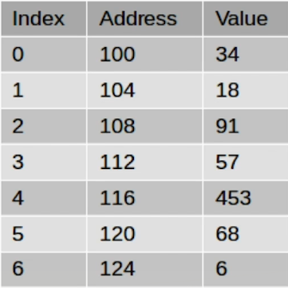
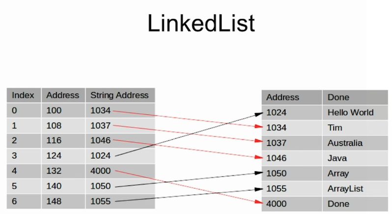

# List Types

List is a `java` interface that is implemented by many casses.

### Array
Arrays inherit from the `List` object. Plain arrays **can only store primitive types**.

#### Syntax:
```java
int[] numbers = new int[10]; // Creates an array with 10 uninitialized positions
numbers[5] = 55;
// or
int[] otherNumbers = { 1, 2, 3, 4, 5, 6, 7, 8, 9 };
// or reassigning (de-referencing)
initializedArray = new int[] { 1, 2, 3, 4, 5, 6, 7, 8, 9 };
```

#### Simple iteratation
```java
public static void printArray(int[] array) {
	for (int i=0; i<array.length; i++) {
		System.out.println("Element " + i + " value is " + array[i]);
	}
}
```

### Sort an Array
This mutates the original array:
```java
Arrays.sort(copyintegers);
```

### Resizing an Array
#### The Manual way
You should copy the old array in a new one and then reassign the new size to the array and loop through the original one to fill up the newly assigned array.

### Output an Array
```java
System.out.println(Arrays.toString(arrayName));
```

### Lists
An **Interface** that represents the structure for an **ordered collection or sequence** of elements.

#### ArrayLists
Extends from `AbstractList` which implements the `List` interface. The interesting feature of `ArrayLists` is that they assign new memory space dynamically when they are resized. `ArrayList` are defined with a **generic type** which informs the compiler on what kind of data they are holding:
```java
private ArrayList<String> myArrayList = new ArrayList<String>();

private void addElementToArrayList(String el) {
	// the logic for resizing and assigning is handled automagically
	myArrayList.add(el);
}
private void replaceElementInArrayList(int position, String el) {
	myArrayList.set(position, el);
}
private void removeElementInArrayList(int position) {
	myArrayList.remove(position);
}
private boolean containsElement(String el) {
	return myArrayList.contains(el);
}
private int containsElementByIndexOf(String el) {
	// returns -1 if not, otherwise returns the element
	return myArrayList.indexOf(el);
}
private void cloneArray(String el) {
	// adds the content of one array to the other
	myArrayList.addAll(readyPopulatedArrayList);
}
private void cloneOnInitializing(String el) {
	// adds the content of one array to the other
	ArrayList<String> myArrayList = new ArrayList<String>(readyPopulatedArrayList);
}
private void convertToArray(String el) {
	// adds the content of one array to the other
	ArrayList<String> myArrayList = new ArrayList<String>();
	// ... populate
	String[] myPureArray = new String[myArrayList.size()];
	myPureArray = myArrayList.toArray(myPureArray);
}
```

### Autoboxing and Unboxing
If we try something like:
```java
private ArrayList<int> myArrayInt = new ArrayList<int>();
```
We get the error: `Type argument cannot be of primitive type`. A primitive type is **not** a `class`, and we need a `class` to be contained within an `ArrayList`. Basically when we want to deal with `primitive data types` in `ArrayList`, we will need to use the `Wrapper Class`, in this case `Integer`.  
To fill an `ArrayList` with numbers, here you are some code example:  
```java
private ArrayList<Integer> myArrayInt = new ArrayList<Integer>();

for (int i=0; i<=10; i++) {
	// This is Autoboxing
	myArrayInt.add(Integer.valueOf(i));
}

for (int i=0; i<=myArrayInt.size(); i++) {
	// This is Unboxing
	System.out.println(i + ". value is " + myArrayInt.get(i).intValue());
}
```
But this is not really `auto`, is it? We needed to write quite some amount of code to do such a simple thing. Don't worry, `java` has you covered:
```java
Integer myInteger = new Integer(22);
// Equals
Integer myInteger = 22;
```
At compile time, the second expression will be converted into the first one. **This is autoboxing**.
```java
Integer myInteger = new Integer(22);
int myInt = myInteger; // Compiler does not complain... UNBOXING!!!
// Behind the scenes, at compile time, this is converted to
int myInt = myInteger.intValue();
```
So now lets make the code before more readable and easy, leveraging on this:
```java
private ArrayList<Integer> myArrayInt = new ArrayList<Integer>();

for (int i=0; i<=10; i++) {
	// This is Autoboxing
	myArrayInt.add(i);
}

for (int i=0; i<=myArrayInt.size(); i++) {
	// This is Unboxing
	System.out.println(i + ". value is " + myArrayInt.get(i));
}
```

### Memory Management
In regular `Arrays` (not `ArrayLists`), `Java` allocates **4 bytes of memory for `int`** for every position. Here you have an example:
  
So `Java` accesses arrays by adding (Position * 4) to the first memory position of the array, in the prior example for position 3 that'd be: `100 + 3 * 4 = 112`.
1. int -> 4 bytes
1. double -> 8 bytes.  
What about strings...? They have **variable size**. Well, for that we have `LinkedLists`!

### LinkedLists
This is another type of `List`, where the `value` is actually a pointer to the position of memory where our data is kept.
  