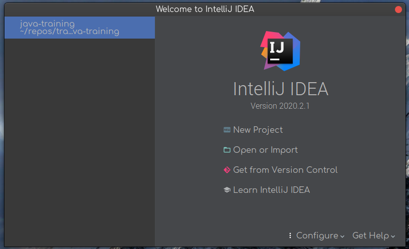
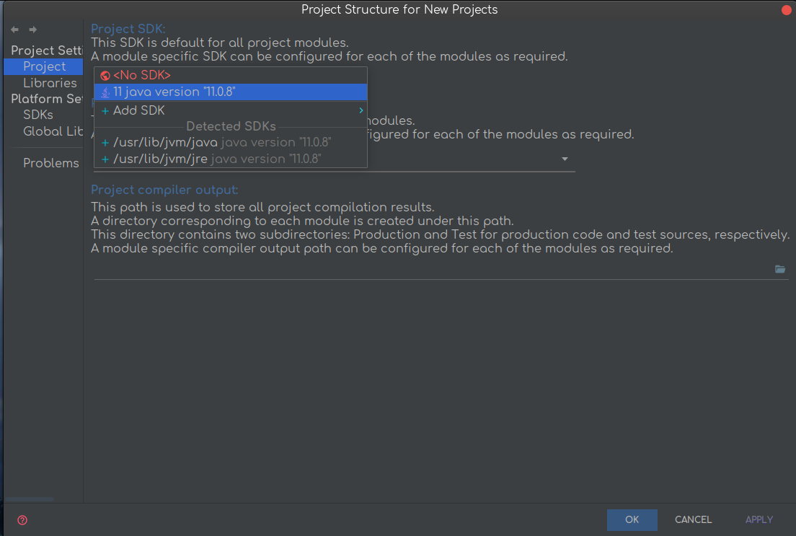
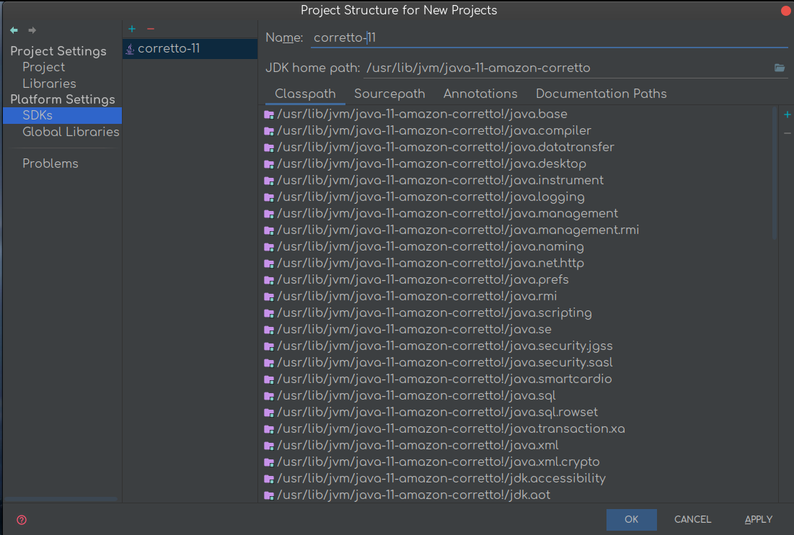
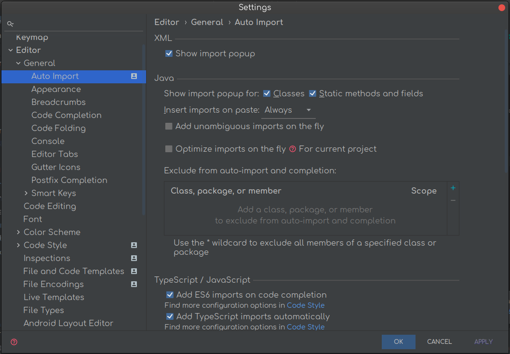
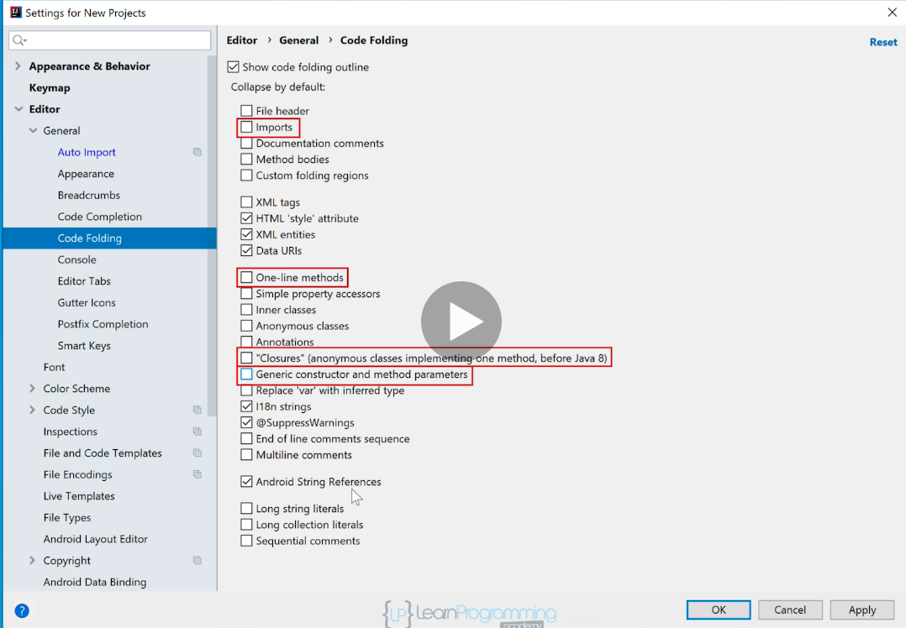

# Configure IDE

### IntelliJ
1. In the bottom dialog that appears when opening the IDE, click on `configure structure for new projects`.  
  
2. Select the installed JDK  
  
3. Also change the name for the SDK, specially useful when running multiple SDKs.  
  
4. Mark these two boxes from General Editor Settings  
  
5. Uncheck these boxes from Code Folding General Editor Settings  
  